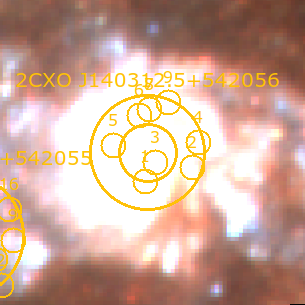

(chap:sourceids)=
# Classifying Optical Counterparts

Once the  2-$\sigma$ radii and optical counterpart(s) of each X-ray source are identified, one will often find that not all X-ray sources are associated with stars. The optical counterpart of an X-ray source may be: 

* the nucleus of the galaxy, 
* a background galaxy, 
* a foreground star,
* a compact star cluster,
* a genuine luminous star, 
* a supernova remnant (SNR), or
* nothing (suggesting the counterpart is a low-mass star that's too dim to be detected by the *HST* observations)

Flagging these classifications is a crucial step in building a clean XRB catalog. For the most part, many of these classifications can be done through visual inspection. For example, in {ref}`chap:astrometry` we saw several examples of visibly-identifiable source types: 

```{figure} ../images/astrometric_calibrators.png
:width: 750px
```
Some cases (such as SNR) require additional analysis to identify, especially if a catalog does not already exist for your galaxy. This chapter outlines both visual and analytical source classification methods.  

## Imaging X-ray sources with `WriteDS9()`
Rather than spend time panning to each source in `DS9` individually, you may find it useful to take `jpeg` or `png` postage stamp images of each X-ray source so that you can browse through them quickly. The quickest way to accomplish this is with `XRBID.WriteScript.WriteDS9()`. This custom function writes an executable bash script that opens a color image and any input region files in `DS9`, flashes to the coordinates of each input source, and saves a zoomed-in and zoomed-out image at that location. You can then open the image files to visually determine which are background galaxies, foreground stars, compact star clusters, etc.  

Before one uses `WriteDS9()`, there are a few steps you should take to make sure the images of each X-ray source are visible and high-quality. This is a fairly involved process. In general, the best procedure for setting up `WriteDS9()` is:

1. Manually create an autoscaling file with a list of [redscale, greenscale, bluescale, xmin, xmax, ymin, ymax]; 
2. Run `XRBID.WriteScript.WriteScalings()` using the new autoscaling file name as the `scalings` argument to create a file with a list of unique location-based scalings for each source; 
3. Run `XRBID.WriteScript.WriteDS9()` using `unique_scale=True` and the new unique scaling file as the `scales` argument; 
4. Run the resulting `.sh` bash file to get scaled images of each source. 

### Manually defining the scale parameters at each image location
Just as each color filter requires a different brightness scaling to adjust the color of the entire galaxy image (see {ref}`sec:astrodrizzle`), different parts of the galaxy will require different brightness scalings due to higher or lower levels of background light. In particular, as you get closer to the center of the galaxy, you will almost always require higher maximum scale parameters in order to lower the overall image brightness and make individual stars visible above the background. 

The best scaling for each region is determined manually through experimenting in `DS9`. In a simple text editing program, open a blank `.txt` file to record your scale parameters; I usually name this `autoscalings.txt` or something to that effect. This file will be used to record the user-defined maximum scale parameter of the red, green, and blue filters (respectively), and the x and y coordinates of the corners of the rectangle within which these scalings apply. These scalings will be read from the outside-in --- that is, the first rectangle defined in the `autoscalings.txt` file represents the outer-most region that requires a unique scaling, the next rectangle represents a region nested within the first rectangle that requires even higher scale parameters to see stars within that region, the next rectangle is nested within *that* rectangle, and so on. This is visualized in {numref}`fig-autoscalings-regs` below. 


```{figure} ../images/M101_autoscalings.png
:name: fig-autoscalings-regs
:width: 500px

Examples of regions that require higher maximum scale parameters. In my case, I defined 3 regions in a file called `autoscalings.txt`, given in {numref}`fig-autoscalings` below. Anything outside of Region 1 defaults to `zscale` for all 3 filters. Sources that fall between Region 1 and Region 2 will be given the scale parameters defined in the first row of `autoscaling.txt`: 0.9 for red, 0.4 for green, and 0.22 for blue. Sources that fall between Region 2 and 3 will be given the scale parameters in the second row; notice the increase in the maximum scale parameters as the background within the region gets brighter. Everything within Region 3 will be given the parameters defined in the last row, which has the highest scale parameters in all three filters. 
```

```{figure} ../images/autoscalings.png
:name: fig-autoscalings
:width: 350px

Examples of user-defined scale parameters and the regions within which they apply. For each row, I define the max scale parameter of the red, green, and blue filters, followed by the minimum x coordinate, maximum x coordinate, minimum y coordinate, and maximum y coordinate (in image/pixel units) of the rectangular region encompassing these parameters (see {numref}`fig-autoscalings-regs` above).  
```

In `DS9`, open a `New RGB Frame` and import the appropriate `FITS` files into the RGB filters. 
The appropriate scaling for the outskirts of the galaxy is usually `zscale` across all three filters; this is the default for any source that falls outside the regions defined in `autoscalings.txt`. 

Closer to the center of the galaxy, there will be some point at which the background brightness becomes so high that the point sources are difficult to see. Mark this region with a rectangle (you can use the `edit > region` and `Region > Shape > Box` tool to help keep track, or write down the minimum x coordinate, maximum x coordinate, minimum y coordinate, and maximum y coordinate of the region in `autoscalings.txt`). Adjust the scale parameter of each RGB filter by selecting the filter, opening the `Scale > Scale Parameter` window, and adjusting the `High` value until the background brightness and stars in the region of interest look reasonable. Record the new RGB scale parameters in `autoscalings.txt`, in the format used in {numref}`fig-autoscalings`. 

Repeat this process for increasingly bright central regions until you have a good set of scale parameters for each region within which the X-ray sources fall. You can create as many nested regions as needed, and you can adjust them later if you find some sources are still difficult to see or exhibit strange colors once you create the postage stamp images with the new scale parameters you provided.

### Defining the scale parameters of each X-ray source

The function `XRBID.WriteScript.WriteScalings()` takes the scale parameters from the text file created above (which I called `autoscalings.txt`) and determines which applies to each source in a given `DataFrame`. The `DataFrame` should contain the ID and image coordinates (which I define under the headers `X` and `Y`) of each source you want to image.

In the example below, I want to create images that include the 1- and 2-$\sigma$ region files of each X-ray source, so I choose to use the `DataFrame` saved in `M101_csc_bestrads.frame` as my base `DataFrame`. I elect to simplify each source ID, to avoid having to use the full CSC ID from this point on. This is totally optional, and if working with multiple galaxies, it's advisable to chose source IDs that include the galaxy name (e.g. M101X001, M101X002, etc.) so that you can differentiate the XRBs at a glance. 

Once I read in the `DataFrame`, I run `WriteScalings()` to create a new scalings file that contains the ID of each source and their RGB scale parameters, which `WriteDS9()` will use to rescale the full-color image as it images each X-ray source.

```
from XRBID.Sources import LoadSources
from XRBID.WriteScript import WriteScalings

M101_best = LoadSources("../testdata/M101_csc_bestrads.frame")

# Renaming each X-ray source as CXO001, CXO002, CXO003, etc. under header "ID"
M101_best["ID"] = ["CXO%03d" % (i+1) for i in range(len(M101_best))]

# Outputs a new scalings file 
WriteScalings(M101_best, outfile="../testdata/M101_XRB_scalings.txt", 
              scalings="../testdata/autoscalings.txt", idheader="ID")
```

```{figure} ../images/M101_XRB_scalings.png
:name: fig-xrbscalings
:width: 500px

Example of the output file from `WriteScalings()`. For each XRB, which have been renumbered for simplicity, the maximum red, green, and blue scale parameters that will produce the best image are given. In my case, since my X-ray sources are sorted by distance from the center of the galaxy, it's natural that the sources at the top of the file have higher scale parameters (lowering the brightness of the background sky) than those farther down the file. 
```

### Making a bash script with `WriteDS9()`

Once a scaling file is created, you can run `WriteDS9()` to create the bash script that will ultimately create the `DS9` postage stamp images. 

```{note}
If you don't create a scalings file as we have just done, `WriteDS9()` will assume a scale of `zscale` for all sources. This will result in several images that are too bright to see, particularly towards the center. 
```

`WriteDS9()` takes as parameters the `DataFrame` containing the sources you want to image, a list of the `FITS` files to be read into the RGB frame (`colorfiles`), a list of any region files you want to include in the images (`regions`), and the name of the scaling file created by `WriteScalings()` (`scales`, with `unique_scales = True`). You'll also want to select one of the filters to use as the base over which the regions are printed (in my case, I use green for F555W), `imgnames` if you want to define a naming convention for the images, and the name of the output `.sh` file. You can also define the `zoom` scale of `DS9`, which is especially useful for sources with a large 2-$\sigma$ radius. 

```
WriteDS9(M101_best, galaxy="M101", zoom=4, 
         unique_scale=True, scales="../testdata/M101_XRB_scalings.txt",
         regions=["../testdata/M101_XRB_candidates.reg",
                  "../testdata/M101_bestrads_1sig.reg", 
                  "../testdata/M101_bestrads_2sig.reg"],
         colorfiles=["../testdata/M101_mosaic_acs_f814w_drc_sci.fits", 
                    "../testdata/M101_mosaic_acs_f555w_drc_sci.fits", 
                    "../testdata/M101_mosaic_acs_f435w_drc_sci.fits"], 
         basefilter=['green'], imgnames="../testdata/M101_XRB_candidates", 
         outfile="../testdata/M101_XRB_candidates.sh", idheader="ID", filetype="png")
```

### Running the bash script

In a terminal, from the directory where the `.sh` bash script is saved, open a `xterm`: 

```
xterm &
```

This should pull up a new window with a different font than your typical terminal. Then, run the bash script: 

```
bash M101_XRB_candidates.sh
```

This should open a full color image in `DS9` and begin flashing through each of the X-ray sources in your `DataFrame` as it saves the images. By default, it saves to two versions: one image at normal zoom, and a second with a farther zoom that has the suffix `_env`. It's best to run the bash script without the `&` so that you can use `Ctrl+C` to shut down the bash script if something goes wrong, or if you notice the user-defined scalings need to be tweaked.

```{note}
If you encounter a display error trying to run the bash script, follow the instructions in {ref}`chap:errors`. 
```

Below are `M101_XRB_candidates_CXO001.png` and `M101_XRB_candidates_CXO012.png`, two of the images that result from running the `.sh` bash script. As we can see, I plotted the  1- and 2-$\sigma$ regions for each X-ray sources, which are labeled with the original "CSC ID", and regions indicating which stars were detected by `RunPhots()` and determined by `DaoClean()` to fall within 2-$\sigma$. The stars have been renumbered for simplicity. CXO001 is the nucleus of M101, and rescaling the maximum scale parameters allows us to see the X-ray source instead of the source being outshined by the background brightness of the galaxy's core! By rescaling, we are able to get images of similar relative brightness, regardless of where they fall in the galaxy. This allows us to see what kind of source it may be at a glance -- in this case, CXO001 is the nucleus, while CXO012 appears to be a regular star, likely of high mass.

 


### Flagging out-of-bounds X-ray sources

It's likely that some of the X-ray sources fall outside the bounds of the *HST* image or within a chip gap and cannot be used for analysis. The easiest way to flag these is to delete the image files for those sources, read in a list of the remaining image files, and flag those X-ray sources as 'good'. 

In the example below, I've manually removed all images of 'bad' sources from the image directory before reading in a list of the image files. 

```
# The only images that remain in this folder are 'good' X-ray sources
imgfiles = glob.glob("*_env.png")
imgfiles.sort()
goodxrbs = [i.split("_")[3] for i in imgfiles]

# Sets all X-ray sources as out-of-bounds by default
M101_best["Bounds"] = "Out"

# Then, sets the sources in the list above as within the bounds of the mosaic
for i in range(len(M101_best)): 
    if M101_best["ID"][i] in goodxrbs: 
        M101_best["Bounds"][i] = "In"
```

## Classifying sources by eye

With the images complete, one should be able to visually inspect and flag any source that looks like a background galaxy (extended, red, and usually disk-like or blobby) or a foreground star (with diffraction spikes).  I recommend creating a file in which you can keep track of the classification of each X-ray source. There are some tools within `XRBID` that can help (such as `XRBID.Sources.SourceList()` or `XRBID.DataFrameMod.BuildFrame()`, depending on how you prefer to work). For M101, I chose to create a `.txt` file that I will use to classify contaminants and keep track of the XRB donor star mass categories in {ref}`chap:cmds`. 

```
# Creating a DataFrame of good XRBs only
M101_xrbs = Find(M101_best, "Bounds = In")

# Adding empty columns that I'll use later
M101_xrbs["Class"] = ""
M101_xrbs["Best Star"] = ""
M101_xrbs["Mass"] = ""
M101_xrbs["Notes"] = ""

M101_notes = BuildFrame(headers=["CSC ID", "ID", "Class", 
                               "Best Star", "Mass", "Notes"], 
                       values=[M101_xrbs["CSC ID"], 
                               M101_xrbs["ID"], 
                               M101_xrbs["Class"], 
                               M101_xrbs["Best Star"], 
                               M101_xrbs["Mass"], 
                               M101_xrbs["Notes"]])

# Saving to a new .txt file. Can also use .frame
M101_notes.to_csv("../testdata/M101_XRB_notes.txt")
```

In the "Class" column of the file, I manually write 'Nucleus', 'AGN', 'Star', or 'Cluster' for the appropriate source using my preferred text editing software. If a source only has a single optical counterpart or a counterpart is one of these classifications, you can go ahead and update the "Best Star" value to reflect the appropriate candidate ID for that source as well. So, for the example of CXO001, I write 'Nucleus' as the "Class" and '3' as the "Best Star".

## Identifying SNR from X-ray colors

While true SNR identification is a multi-wavelength process that requires a lot of work, a shortcut using just X-ray colors was developed in